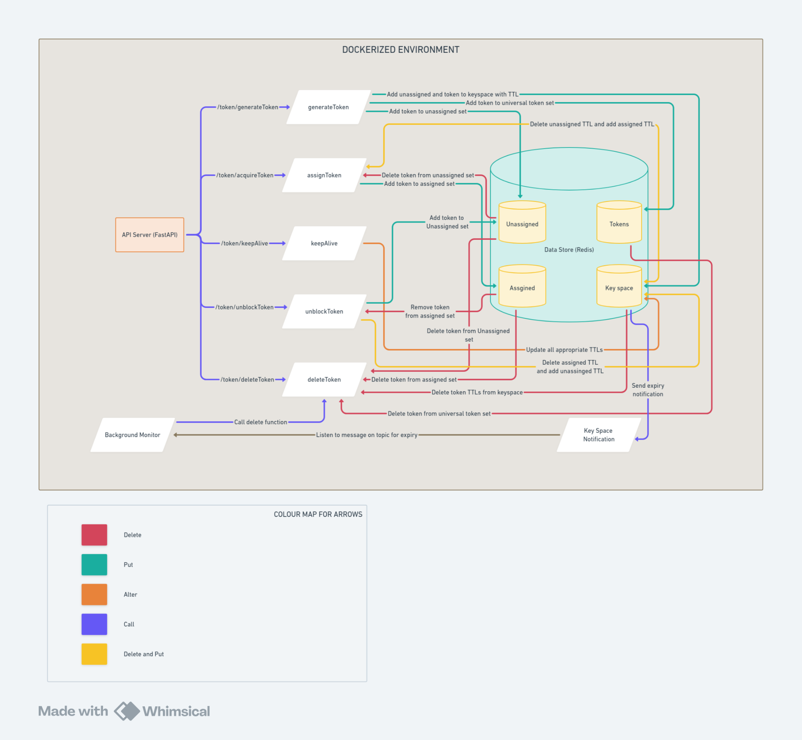

# TokenDistributor

TokenDistributor is a Python-based token management system that uses Redis for efficient token distribution, assignment, and lifecycle management. This system ensures that token operations such as generation, assignment, keep-alive, unblocking, and deletion are handled efficiently with minimal complexity.

## Features

- **Token Generation**: Creates tokens and stores them in the `Unassigned` and `Tokens` set with a specified TTL.
- **Token Assignment**: Randomly assigns tokens from the `Unassigned` set to the `Assigned` set with a different TTL.
- **Keep-Alive**: Extends the TTL of assigned tokens to prevent them from expiring.
- **Token Unblocking**: Moves tokens from the `Assigned` set back to the `Unassigned` set with their original TTL.
- **Automatic Expiration**: Tokens are automatically expired and managed through Redis TTL and keyspace notifications.

## Project Structure

```
TokenDistributor/
│
├── app/
│   ├── __init__.py
│   ├── main.py               # Entry point for the FastAPI application
│   ├── config.py             # Configuration settings for the application
│   ├── logger.py             # Logger setup for the application
│   ├── routers/              # Contains API route definitions
│   ├── schema/               # Pydantic models for request and response validation
│   ├── services/             # Core business logic and interaction with Redis
│   ├── utils/                # Utility functions and helpers
│   └── tests/                # Unit and integration tests
│
├── Dockerfile                # Dockerfile for containerizing the application
├── docker-compose.yaml       # Docker Compose file for setting up Redis and the application
├── requirements.txt          # Python dependencies
└── .env                      # Environment variables for the application
```

## Installation

### Prerequisites

- Docker and Docker Compose installed on your machine.
- Redis-server with keyspace notifications active if running locally
- Python 3.12.3 installed if running locally.

### Steps

1. **Clone the Repository**:

   ```bash
   git clone https://github.com/your-repo/TokenDistributor.git
   cd TokenDistributor
   ```

2. **Setup Environment**:

   Copy the `.env.example` file to `.env` and fill in the necessary environment variables.

   ```bash
   cp .env.example .env
   ```

3. **Build and Run the Application**:

   Using Docker:

   ```bash
   docker-compose up --build
   ```

   Running Locally:

   ```bash
   python -m venv .venv
   source .venv/bin/activate  # On Windows use `.venv\Scriptsctivate`
   pip install -r requirements.txt
   uvicorn app.main:app --reload
   ```
   
   ```bash
   # Update redis server to send out keyspace notifications
   redis-cli CONFIG SET notify-keyspace-events KEA
   ```

## API Endpoints

### 1. Generate New Token

- **Endpoint**: `POST /token/generateToken`
- **Description**: Generates a new token and stores it in the `Unassigned` and `Tokens` set with a specified TTL.
- **Response**:
  - **200 OK**: The newly generated token.
  - **400 Bad Request**: If there is an error during token generation.

### 2. Acquire Token

- **Endpoint**: `GET /token/acquireToken`
- **Description**: Assigns a token from the `Unassigned` set to the `Assigned` set and returns it.
- **Response**:
  - **200 OK**: The assigned token.
  - **400 Bad Request**: If there is an error during token assignment.

### 3. Keep Token Alive

- **Endpoint**: `PUT /token/keepAlive`
- **Description**: Extends the TTL of an assigned token to keep it alive.
- **Request Body**:
  - **Token**: The token to keep alive.
- **Response**:
  - **200 OK**: Confirmation that the token's TTL has been extended.
  - **400 Bad Request**: If there is an error during the keep-alive operation.

### 4. Unblock Token

- **Endpoint**: `PUT /token/unblock`
- **Description**: Moves a token from the `Assigned` set back to the `Unassigned` set.
- **Request Body**:
  - **Token**: The token to unblock.
- **Response**:
  - **200 OK**: Confirmation that the token has been unblocked.
  - **400 Bad Request**: If there is an error during the unblock operation.

### 5. Delete Expired Token

- **Endpoint**: `DELETE /token/deleteExpiredToken`
- **Description**: Deletes tokens that have expired from the `Token` set.
- **Response**:
  - **200 OK**: Confirmation that expired tokens have been deleted.
  - **400 Bad Request**: If there is an error during the deletion process.

## Usage

Access the API documentation at `http://localhost:8000/docs` for detailed information on available endpoints and their usage.

## Testing

Run the tests using pytest:

```bash
pytest
```

## System Diagram

Here’s a high-level overview of the system architecture:

1. **FastAPI Application**: Acts as the backend server providing RESTful APIs for managing tokens.
2. **Redis**: Serves as the in-memory data store for tokens, utilizing sets for efficient management and keyspace notifications for TTL-based expiration handling.
3. **Docker**: Containerizes the application and Redis for easy deployment and scalability.




## Demo Video

Here’s a demo video of the TokenDistributor system:

